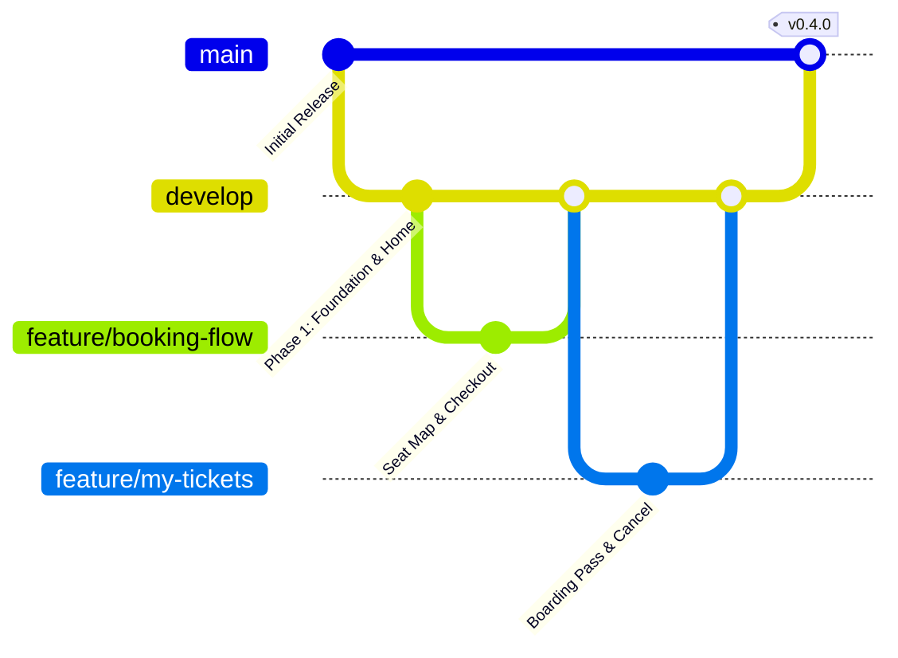

# VexGo - Ứng Dụng Đặt Vé Xe Khách Trực Tuyến (Mobile App)

Ứng dụng di động đặt vé xe khách trực tuyến **VexGo** được xây dựng trên nền tảng **Flutter**, phục vụ Đồ án Khóa luận Tốt nghiệp với trải nghiệm người dùng hiện đại, lấy cảm hứng từ nền tảng đặt vé xe khách hàng đầu Việt Nam (Vexere).

---

## 🚀 Công Nghệ Sử Dụng

- **Framework**: [Flutter](https://flutter.dev/) (SDK ^3.10.7 / Flutter 3.38+)
- **Ngôn ngữ**: [Dart](https://dart.dev/)
- **Quản lý trạng thái (State Management)**: [flutter_bloc](https://pub.dev/packages/flutter_bloc) & [equatable](https://pub.dev/packages/equatable) (Kiến trúc BLoC phân lớp Event - State - Bloc theo Clean Architecture)
- **Điều hướng (Routing)**: [go_router](https://pub.dev/packages/go_router) (Hỗ trợ Declarative Routing, Nested Shell Navigation)
- **Thiết kế UI/UX**: Tuân thủ tiêu chuẩn **`ui-ux-pro-max`** (Contrast $\ge 4.5:1$, Touch targets $\ge 44 \times 44\text{px}$, Defensive Layout chống tràn viền trên màn hình chuẩn 360dp - Realme 11).
- **Thư viện bổ trợ**:
  - `google_fonts`: Phông chữ hiện đại
  - `intl`: Định dạng tiền tệ VND, thời gian tiếng Việt
  - `qr_flutter`: Tạo mã vé điện tử QR Code
  - `shimmer`: Hiệu ứng tải dữ liệu khung xương (Skeleton loading)
  - `flutter_svg`: Hiển thị icon vector sắc nét

---

## 🌿 Quy Trình Nhánh Git Flow (Git Flow Workflow)

Dự án áp dụng mô hình phân nhánh chuẩn **Git Flow**:



- **`main`**: Nhánh chứa mã nguồn chính thức, ổn định và sẵn sàng nghiệm thu/demo.
- **`develop`**: Nhánh tích hợp chính cho tất cả các tính năng đang phát triển.
- **`feature/<ten-tinh-nang>`**: Nhánh rẽ từ `develop` để xây dựng từng tính năng hoặc màn hình độc lập, sau khi hoàn thành sẽ merge ngược lại vào `develop`.
- **`release/<phien-ban>`**: Nhánh đóng gói, kiểm thử giao diện và chuẩn bị bàn giao.
- **`hotfix/<ma-loi>`**: Nhánh sửa lỗi khẩn cấp rẽ trực tiếp từ `main`.

---

## 📱 Các Chức Năng Đã Triển Khai (Features)

### 1. Khung Giao Diện & Màn Hình Chính (Phase 1)
- Thanh điều hướng đáy 4 tab: **Trang chủ**, **Vé của tôi**, **Thông báo**, **Tài khoản**.
- Màn hình Trang chủ: Form tìm kiếm chuyến xe nhanh (Nơi đi, Nơi đến, Ngày đi), Danh sách tuyến đường phổ biến, Các nhà xe đối tác (FUTA, Hoa Mai, Sao Việt, Kumho...), Băng chuyền khuyến mại.

### 2. Tìm Kiếm & Lọc Chuyến Xe (Phase 2)
- Thanh chọn ngày đi nhanh dạng cuộn ngang.
- Thẻ chuyến xe (`TripCard`) đầy đủ thông tin: Giờ khởi hành, thời gian di chuyển, giờ đến, điểm đón/trả cụ thể, số ghế trống, giá vé từ thấp nhất, đánh giá sao.
- Bộ lọc nâng cao: Lọc theo khung giờ (Sáng, Chiều, Tối), nhà xe, mức giá.

### 3. Luồng Đặt Vé Khép Kín 6 Bước (Phase 3)
1. **Bước 1: Chọn chỗ ngồi**: Sơ đồ xe Limousine / Giường nằm 2 tầng trực quan, phân biệt trạng thái Ghế trống / Đang chọn / Đã bán, tự động cập nhật tổng tiền.
2. **Bước 2: Điểm đón**: Danh sách bến xe, văn phòng nhà xe kèm địa chỉ chi tiết.
3. **Bước 3: Điểm trả**: Lựa chọn điểm trả khách tại thành phố đến.
4. **Bước 4: Thông tin hành khách**: Nhập Họ tên, Số điện thoại, Email và ghi chú.
5. **Bước 5: Tóm tắt chuyến đi**: Lịch trình chi tiết, đồng hồ đếm ngược giữ chỗ 10:00 phút, áp dụng mã giảm giá voucher (`VEXGO50K`, `HE2026`).
6. **Bước 6: Thanh toán & Xuất vé**: Lựa chọn phương thức thanh toán (MoMo, ZaloPay, VNPay, Chuyển khoản QR, Tiền mặt) và điều hướng đến màn hình vé QR thành công.

### 4. Quản Lý Vé Của Tôi & Hậu Đặt Vé (Phase 4)
- **3 Tab Trạng Thái**: `Sắp đi`, `Đã đi`, `Đã hủy` kèm huy hiệu số lượng vé thực tế.
- **Thẻ vé Boarding Pass**: Thiết kế vé vật lý với rãnh xé vé đục lỗ, mã vé, QR Code, đầy đủ thông tin nhà xe, biển số xe, tuyến đường và thanh tiến trình thời gian.
- **Xem QR Soát vé**: Hỗ trợ phóng to mã QR toàn màn hình kèm mã vé để nhân viên nhà xe quét lúc lên xe (`UC_SoatVe`).
- **Hủy vé (`sub_uc_huy_ve`)**: Áp dụng quy tắc nghiệp vụ: Chỉ cho phép hủy trước giờ khởi hành $\ge 3$ tiếng, tính toán mức hoàn tiền 90% minh bạch.
- **Đổi vé (`sub_uc_doi_ve`)**: Hướng dẫn quy trình đổi chuyến cùng tuyến và liên hệ tổng đài nhà xe.
- **Đánh giá chuyến đi (`UC12`)**: Đánh giá 1-5 sao kèm các nhãn nhận xét nhanh ("Đúng giờ", "Tài xế thân thiện", "Xe sạch sẽ").

---

## 🛠 Hướng Dẫn Cài Đặt & Chạy Ứng Dụng

### Yêu cầu môi trường
- Flutter SDK $\ge 3.10.7$
- Android SDK (Hỗ trợ Android 8.0 Oreo trở lên) hoặc iOS Simulator

### Các bước khởi chạy
```bash
# 1. Di chuyển vào thư mục dự án
cd vexgo_app

# 2. Cài đặt các thư viện phụ thuộc
flutter pub get

# 3. Chạy kiểm tra tĩnh mã nguồn
flutter analyze

# 4. Chạy toàn bộ test suites (BLoC & Business Rules)
flutter test

# 5. Khởi chạy ứng dụng trên thiết bị/máy ảo
flutter run
```

---

## 📂 Cấu Trúc Thư Mục Chuẩn (Feature-First)

```
lib/
├── app/                  # Khởi tạo App, Routes (GoRouter), Theme & Tokens
├── core/                 # Shared widgets (CustomButton, Inputs, Header, EmptyState)
├── data/
│   ├── models/           # TripModel, SeatModel, TicketModel, ReviewModel, Voucher...
│   └── repositories/     # Mock repositories đọc dữ liệu từ JSON
└── features/
    └── user/
        ├── home/         # Trang chủ
        ├── search_trips/ # Tìm kiếm & Lọc chuyến
        ├── booking/      # Luồng đặt vé 6 bước & BookingFlowBloc
        ├── my_bookings/  # Vé của tôi & MyTicketsBloc
        ├── notification/ # Thông báo chuyến đi & ưu đãi
        └── profile/      # Tài khoản cá nhân & Tích điểm
```
